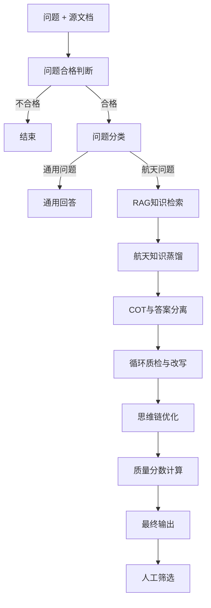

# 航天大模型RAG问答对蒸馏系统

## 项目简介

本项目旨在为航天领域大模型构建高质量的SFT（监督微调）训练数据集。采用基于RAG（检索增强生成）的问答对蒸馏管线，通过"AI生成 + 人工筛选"的方式，最大程度降低标注成本，提高数据生产效率。

**核心价值**：
- 🚀 效率提升5-10倍
- 💰 成本降低70-85%
- ✨ 质量媲美人工编写
- 📊 可规模化到数万级数据

---

## 文档导航

### 📄 核心文档

1. **[RAG问答对蒸馏优势报告](./RAG问答对蒸馏优势报告.md)** - 完整技术报告
   - 详细的技术架构说明
   - 工作流程详解
   - 质量保障机制
   - 实施路线图

2. **[执行摘要-RAG蒸馏管线](./执行摘要-RAG蒸馏管线.md)** - 管理层汇报版
   - 核心优势概览
   - 预期成效
   - 实施路线图
   - 下一步行动

3. **[方法对比分析](./方法对比分析.md)** - 技术选型参考
   - 6种方法详细对比
   - 成本效益分析
   - 决策矩阵
   - FAQ

### 🔧 技术资源

4. **[rag_qa_dify.yml](./rag_qa_dify.yml)** - Dify工作流配置文件
   - 完整的工作流定义
   - 节点配置详情
   - 提示词模板

---

## 快速开始

### 系统架构

```
输入 → 问题判断 → 分类 → RAG检索 → 知识蒸馏 → 循环质检 → 思维链优化 → 质量评分 → 输出
```

### 关键特性

1. **5层质检机制**
   - 问题合格性判断
   - 问题分类（航天/通用）
   - 准确性校验
   - 全面性校验
   - 质量分数评估

2. **循环改写机制**
   - 最多5轮自动优化
   - 未通过自动改写
   - 通过后退出循环

3. **思维链优化**
   - 增强模型推理能力
   - 提升训练效果
   - 提供可解释性

4. **质量量化评分**
   - 0-100分综合评分
   - 4个质量等级
   - 详细扣分说明

---

## 技术栈

- **大模型**：DeepSeek-R1, Qwen3-30B系列
- **重排序模型**：bce-reranker-base_v1
- **工作流平台**：Dify
- **推理服务**：SiliconFlow, 通义千问

---

## 数据流程



---

## 对比优势

| 维度 | RAG蒸馏 | 纯人工 | 众包 | 模板 | 纯LLM | 爬取 |
|------|---------|--------|------|------|-------|------|
| 质量 | ⭐⭐⭐⭐⭐ | ⭐⭐⭐⭐⭐ | ⭐⭐⭐ | ⭐⭐ | ⭐⭐ | ⭐⭐⭐ |
| 专业性 | ⭐⭐⭐⭐⭐ | ⭐⭐⭐⭐⭐ | ⭐⭐ | ⭐⭐ | ⭐⭐ | ⭐⭐ |
| 效率 | ⭐⭐⭐⭐⭐ | ⭐ | ⭐⭐⭐ | ⭐⭐⭐⭐⭐ | ⭐⭐⭐⭐⭐ | ⭐⭐⭐⭐ |
| 规模化 | ⭐⭐⭐⭐⭐ | ⭐ | ⭐⭐⭐⭐ | ⭐⭐⭐⭐ | ⭐⭐⭐⭐⭐ | ⭐⭐⭐⭐ |
| 可追溯 | ⭐⭐⭐⭐⭐ | ⭐⭐⭐⭐⭐ | ⭐⭐⭐ | ⭐ | ⭐ | ⭐⭐ |

**结论**：RAG蒸馏是质量、效率、成本的最优平衡点

---

## 预期成效

- **数据规模**：3-6个月产出5万-10万条
- **质量达标率**：经筛选后60-75%可用
- **成本对比**：约100-200元/千条（纯人工约500-1000元/千条）
- **效率提升**：单人日产有效数据105-140条（纯人工9-19条）

---

## 实施路线

### 第一阶段：准备期（1-2个月）
- 构建航天知识库
- 设计专业提示词
- 组建标注团队
- 制定质量标准

### 第二阶段：试运行（1个月）
- 小规模测试（100-500条）
- 人工深度审核
- 优化流程和提示词

### 第三阶段：规模化生产（3-6个月）
- 批量处理
- 实时质量监控
- 持续优化

---

## 适用场景

✅ 垂直领域大模型训练（航天、医疗、法律等）  
✅ 知识密集型问答数据集构建  
✅ 需要专业性和可追溯性的场景  
✅ 预算有限但需要高质量数据的项目  

---

## 联系方式

如有问题或建议，欢迎联系项目团队。

---

**版本**：v1.0  
**更新日期**：2025年11月  
**许可证**：MIT